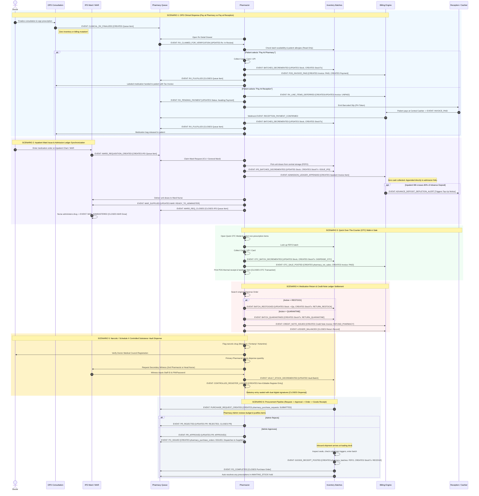

# North Hospital Enterprise HMS — Pharmacy Database ERD, Permissions Matrix & Inter-Departmental Event Flows

**Document Version:** 2.0  
**Target Milestone:** Level 3 Department Module — Pharmacy & Formulary Engine  
**Standard:** Strict Conformance to `hms-design-bible.md`  
**Status:** Ready for Final Review & Phase 1 Schema Implementation Sign-Off  

---

# SECTION 1: COMPLETE DATABASE ENTITY RELATIONSHIP DIAGRAM (ERD)

## 1.1 Complete Mermaid ERD

```mermaid
erDiagram
    users ||--o{ pharmacy_purchase_requests : "requested_by"
    users ||--o{ pharmacy_purchase_orders : "approved_by"
    users ||--o{ pharmacy_batches : "received_by"
    users ||--o{ pharmacy_dispense_orders : "dispensed_by"
    users ||--o{ pharmacy_otc_sales : "sold_by"
    users ||--o{ pharmacy_returns : "processed_by"
    users ||--o{ pharmacy_controlled_drug_register : "primary_pharmacist"
    users ||--o{ pharmacy_controlled_drug_register : "witness_staff"

    patients ||--o{ pharmacy_dispense_orders : "recipient"
    patients ||--o{ pharmacy_returns : "returning_patient"
    patients ||--o{ pharmacy_controlled_drug_register : "patient"
    
    clinical_prescriptions ||--o{ pharmacy_dispense_orders : "fulfills"
    ipd_admissions ||--o{ pharmacy_dispense_orders : "charged_to"

    billing_invoices ||--o{ pharmacy_dispense_orders : "settled_via"
    billing_invoices ||--o{ pharmacy_returns : "refund_credit_note"

    pharmacy_suppliers ||--o{ pharmacy_purchase_orders : "supplies"
    pharmacy_suppliers ||--o{ pharmacy_batches : "vendor_source"

    pharmacy_purchase_requests ||--|{ pharmacy_purchase_request_items : "contains"
    pharmacy_medicines ||--o{ pharmacy_purchase_request_items : "item_sku"

    pharmacy_purchase_orders ||--|{ pharmacy_purchase_order_items : "contains"
    pharmacy_purchase_requests ||--o| pharmacy_purchase_orders : "converted_from"
    pharmacy_medicines ||--o{ pharmacy_purchase_order_items : "ordered_sku"

    pharmacy_medicines ||--|{ pharmacy_batches : "has_stock_in"
    pharmacy_purchase_orders ||--o{ pharmacy_batches : "grn_origin"

    pharmacy_batches ||--o{ pharmacy_stock_transactions : "mutates_audit"
    pharmacy_medicines ||--o{ pharmacy_stock_transactions : "formulary_audit"

    pharmacy_dispense_orders ||--|{ pharmacy_dispense_order_items : "contains"
    pharmacy_medicines ||--o{ pharmacy_dispense_order_items : "dispensed_medicine"
    pharmacy_batches ||--o{ pharmacy_dispense_order_items : "allocated_from_batch"

    pharmacy_otc_sales ||--|{ pharmacy_otc_sale_items : "contains"
    pharmacy_medicines ||--o{ pharmacy_otc_sale_items : "otc_sku"
    pharmacy_batches ||--o{ pharmacy_otc_sale_items : "deducted_from_batch"

    pharmacy_dispense_orders ||--o{ pharmacy_returns : "original_dispense"
    pharmacy_returns ||--|{ pharmacy_return_items : "contains"
    pharmacy_medicines ||--o{ pharmacy_return_items : "returned_sku"
    pharmacy_batches ||--o{ pharmacy_return_items : "restocked_to_batch"

    pharmacy_dispense_orders ||--o{ pharmacy_controlled_drug_register : "statutory_log"
    pharmacy_medicines ||--o{ pharmacy_controlled_drug_register : "narcotic_sku"
    pharmacy_batches ||--o{ pharmacy_controlled_drug_register : "vault_batch"

    pharmacy_medicines {
        uuid id PK
        varchar item_code UK
        varchar name
        varchar generic_name
        varchar category
        varchar therapeutic_class
        varchar strength
        varchar unit_of_measure
        decimal unit_price
        decimal cost_price
        integer reorder_level
        integer reorder_quantity
        boolean requires_prescription
        boolean is_high_risk
        boolean is_narcotic
        jsonb known_allergens
        boolean is_active
        timestamp created_at
        timestamp updated_at
    }

    pharmacy_suppliers {
        uuid id PK
        varchar supplier_code UK
        varchar name
        varchar contact_person
        varchar phone
        varchar email
        varchar drug_license_number
        varchar tax_number
        integer payment_terms_days
        text address
        boolean is_active
        timestamp created_at
    }

    pharmacy_purchase_requests {
        uuid id PK
        varchar pr_number UK
        uuid requested_by_id FK
        varchar priority
        varchar status
        text notes
        uuid approved_by_id FK
        timestamp approved_at
        text rejection_reason
        timestamp created_at
    }

    pharmacy_purchase_request_items {
        uuid id PK
        uuid purchase_request_id FK
        uuid medicine_id FK
        integer requested_quantity
        decimal estimated_unit_cost
    }

    pharmacy_purchase_orders {
        uuid id PK
        varchar po_number UK
        uuid purchase_request_id FK
        uuid supplier_id FK
        uuid approved_by_id FK
        varchar status
        decimal total_order_amount
        date expected_delivery_date
        timestamp issued_at
        timestamp completed_at
    }

    pharmacy_purchase_order_items {
        uuid id PK
        uuid purchase_order_id FK
        uuid medicine_id FK
        integer ordered_quantity
        integer received_quantity
        decimal agreed_unit_price
        decimal subtotal_amount
    }

    pharmacy_batches {
        uuid id PK
        uuid medicine_id FK
        uuid purchase_order_id FK
        uuid supplier_id FK
        varchar batch_number
        date manufacturing_date
        date expiry_date
        integer initial_quantity
        integer available_quantity
        integer reserved_quantity
        decimal cost_price
        decimal mrp_price
        varchar storage_location
        boolean is_quarantined
        varchar status
        uuid received_by_id FK
        timestamp created_at
    }

    pharmacy_stock_transactions {
        uuid id PK
        uuid medicine_id FK
        uuid batch_id FK
        varchar transaction_type
        integer quantity_delta
        integer balance_after
        varchar reference_type
        uuid reference_id
        text reason_or_notes
        uuid performed_by_id FK
        timestamp created_at
    }

    pharmacy_dispense_orders {
        uuid id PK
        varchar order_number UK
        uuid prescription_id FK
        uuid patient_id FK
        varchar encounter_type
        uuid admission_id FK
        varchar ward_name
        varchar settlement_mode
        varchar payment_status
        varchar payment_method
        decimal total_amount
        decimal co_pay_amount
        decimal payer_covered_amount
        varchar insurance_policy_number
        varchar tpa_preauth_code
        varchar corporate_client_id
        varchar corporate_employee_id
        varchar credit_facility_account
        uuid credit_authorized_by_id FK
        varchar status
        uuid billing_invoice_id FK
        uuid dispensed_by_id FK
        timestamp dispensed_at
        timestamp created_at
    }

    pharmacy_dispense_order_items {
        uuid id PK
        uuid dispense_order_id FK
        uuid medicine_id FK
        uuid batch_id FK
        integer prescribed_quantity
        integer dispensed_quantity
        decimal unit_price
        decimal line_total
        varchar dosage_instruction
    }

    pharmacy_otc_sales {
        uuid id PK
        varchar sale_number UK
        varchar customer_name
        varchar customer_phone
        uuid registered_patient_id FK
        decimal subtotal_amount
        decimal tax_amount
        decimal total_amount
        varchar payment_mode
        varchar payment_reference
        boolean cashier_settled
        uuid billing_invoice_id FK
        uuid sold_by_id FK
        timestamp created_at
    }

    pharmacy_otc_sale_items {
        uuid id PK
        uuid otc_sale_id FK
        uuid medicine_id FK
        uuid batch_id FK
        integer quantity
        decimal unit_price
        decimal tax_rate
        decimal line_total
    }

    pharmacy_returns {
        uuid id PK
        varchar return_number UK
        uuid original_dispense_order_id FK
        uuid patient_id FK
        varchar return_type
        decimal total_refund_amount
        uuid credit_note_id FK
        text reason
        boolean condition_verified
        uuid processed_by_id FK
        timestamp created_at
    }

    pharmacy_return_items {
        uuid id PK
        uuid return_id FK
        uuid dispense_order_item_id FK
        uuid medicine_id FK
        uuid batch_id FK
        integer quantity_returned
        decimal refund_unit_price
        decimal line_refund_total
        varchar action
        text action_notes
    }

    pharmacy_controlled_drug_register {
        uuid id PK
        varchar entry_number UK
        uuid medicine_id FK
        uuid batch_id FK
        uuid patient_id FK
        varchar prescribing_doctor_name
        varchar doctor_license_number
        integer quantity_dispensed
        integer balance_stock_after
        uuid primary_pharmacist_id FK
        uuid witness_staff_id FK
        varchar witness_role
        uuid dispense_order_id FK
        timestamp created_at
    }
```

---

## 1.2 Table Specifications, Constraints & Foreign Key Rules

### 1. `pharmacy_medicines` (Master Formulary Master)
- **Primary Key:** `id` (UUID)
- **Natural Key / Indexes:** `item_code` (Unique), `name` (Index), `generic_name` (Index), `category` (Index), `is_narcotic` (Index)
- **Constraints:**
  - `unit_price >= 0.00`, `cost_price >= 0.00`
  - `reorder_level >= 0`, `reorder_quantity > 0`
- **Delete Rule:** Soft-delete only (`is_active = FALSE`). Never hard-delete if referenced in batches or history.

### 2. `pharmacy_suppliers` (Wholesale Distributor Master)
- **Primary Key:** `id` (UUID)
- **Natural Key / Indexes:** `supplier_code` (Unique), `name` (Index), `drug_license_number` (Not Null)
- **Constraints:** `payment_terms_days >= 0`
- **Delete Rule:** Soft-delete only (`is_active = FALSE`).

### 3. `pharmacy_purchase_requests` & `pharmacy_purchase_request_items`
- **Primary Keys:** `id` (UUID)
- **Relationships:**
  - `requested_by_id` -> `users.id` (`ON DELETE RESTRICT`)
  - `approved_by_id` -> `users.id` (`ON DELETE SET NULL`)
  - `purchase_request_id` -> `pharmacy_purchase_requests.id` (`ON DELETE CASCADE`)
  - `medicine_id` -> `pharmacy_medicines.id` (`ON DELETE RESTRICT`)
- **Status Enum:** `SUBMITTED`, `UNDER_REVIEW`, `APPROVED`, `REJECTED`, `CONVERTED_TO_PO`

### 4. `pharmacy_purchase_orders` & `pharmacy_purchase_order_items`
- **Primary Keys:** `id` (UUID)
- **Relationships:**
  - `purchase_request_id` -> `pharmacy_purchase_requests.id` (`ON DELETE SET NULL`)
  - `supplier_id` -> `pharmacy_suppliers.id` (`ON DELETE RESTRICT`)
  - `approved_by_id` -> `users.id` (`ON DELETE RESTRICT`)
  - `purchase_order_id` -> `pharmacy_purchase_orders.id` (`ON DELETE CASCADE`)
  - `medicine_id` -> `pharmacy_medicines.id` (`ON DELETE RESTRICT`)
- **Status Enum:** `DRAFT`, `ISSUED`, `PARTIALLY_RECEIVED`, `COMPLETED`, `CANCELLED`

### 5. `pharmacy_batches` (FEFO Physical Inventory Vault)
- **Primary Key:** `id` (UUID)
- **Composite Index:** `[medicine_id, expiry_date, available_quantity]` (Critical for fast FEFO lookups)
- **Relationships:**
  - `medicine_id` -> `pharmacy_medicines.id` (`ON DELETE RESTRICT`)
  - `purchase_order_id` -> `pharmacy_purchase_orders.id` (`ON DELETE SET NULL`)
  - `supplier_id` -> `pharmacy_suppliers.id` (`ON DELETE RESTRICT`)
  - `received_by_id` -> `users.id` (`ON DELETE RESTRICT`)
- **Constraints:**
  - `available_quantity >= 0`, `reserved_quantity >= 0`
  - `available_quantity + reserved_quantity <= initial_quantity`
  - `expiry_date >= manufacturing_date`
- **Status Enum:** `ACTIVE`, `DEPLETED`, `EXPIRED`, `QUARANTINED`, `RECALLED`

### 6. `pharmacy_stock_transactions` (Immutable Audit Ledger)
- **Primary Key:** `id` (UUID)
- **Indexes:** `[medicine_id, created_at]`, `[batch_id, created_at]`, `[reference_type, reference_id]`
- **Transaction Types:** `RECEIVE_PO`, `DISPENSE_OPD`, `ISSUE_IPD`, `SALE_OTC`, `RETURN_RESTOCK`, `RETURN_QUARANTINE`, `AUDIT_ADJUSTMENT`, `EXPIRED_DISPOSAL`
- **Invariant:** Append-only ledger. Updates and deletions are blocked by database trigger.

### 7. `pharmacy_dispense_orders` & `pharmacy_dispense_order_items`
- **Primary Keys:** `id` (UUID)
- **Relationships:**
  - `prescription_id` -> `clinical_prescriptions.id` (`ON DELETE SET NULL`)
  - `patient_id` -> `patients.id` (`ON DELETE RESTRICT`)
  - `admission_id` -> `ipd_admissions.id` (`ON DELETE SET NULL`)
  - `billing_invoice_id` -> `billing_invoices.id` (`ON DELETE SET NULL`)
  - `credit_authorized_by_id` -> `users.id` (`ON DELETE SET NULL`)
  - `dispensed_by_id` -> `users.id` (`ON DELETE RESTRICT`)
  - `dispense_order_id` -> `pharmacy_dispense_orders.id` (`ON DELETE CASCADE`)
  - `batch_id` -> `pharmacy_batches.id` (`ON DELETE RESTRICT`)
- **Settlement Modes:** `PAY_AT_PHARMACY`, `PAY_AT_RECEPTION`, `INSURANCE`, `CORPORATE`, `CREDIT`, `IPD_RUNNING_BILL`
- **Payment Statuses:** `PAID`, `UNPAID`, `INSURANCE_PENDING`, `CORPORATE_PENDING`, `CREDIT_AUTHORIZED`, `DISCHARGE_SETTLED`

### 8. `pharmacy_otc_sales` & `pharmacy_otc_sale_items`
- **Primary Keys:** `id` (UUID)
- **Relationships:**
  - `registered_patient_id` -> `patients.id` (`ON DELETE SET NULL`)
  - `sold_by_id` -> `users.id` (`ON DELETE RESTRICT`)
  - `otc_sale_id` -> `pharmacy_otc_sales.id` (`ON DELETE CASCADE`)
  - `batch_id` -> `pharmacy_batches.id` (`ON DELETE RESTRICT`)

### 9. `pharmacy_returns` & `pharmacy_return_items`
- **Primary Keys:** `id` (UUID)
- **Relationships:**
  - `original_dispense_order_id` -> `pharmacy_dispense_orders.id` (`ON DELETE RESTRICT`)
  - `patient_id` -> `patients.id` (`ON DELETE RESTRICT`)
  - `processed_by_id` -> `users.id` (`ON DELETE RESTRICT`)
  - `credit_note_id` -> `billing_invoices.id` (`ON DELETE RESTRICT`)
  - `batch_id` -> `pharmacy_batches.id` (`ON DELETE RESTRICT`)
- **Return Action:** `RESTOCK` (returns into available stock) or `QUARANTINE` (destined for disposal).

### 10. `pharmacy_controlled_drug_register` (Statutory Narcotic Log)
- **Primary Key:** `id` (UUID)
- **Sequence Index:** `entry_number` (Continuous non-gapped sequential number)
- **Relationships:**
  - `medicine_id` -> `pharmacy_medicines.id` (`ON DELETE RESTRICT`)
  - `batch_id` -> `pharmacy_batches.id` (`ON DELETE RESTRICT`)
  - `patient_id` -> `patients.id` (`ON DELETE RESTRICT`)
  - `primary_pharmacist_id` -> `users.id` (`ON DELETE RESTRICT`)
  - `witness_staff_id` -> `users.id` (`ON DELETE RESTRICT`)
  - `dispense_order_id` -> `pharmacy_dispense_orders.id` (`ON DELETE RESTRICT`)
- **Invariant:** Immutable ledger. Any modification or deletion is blocked by DB triggers.

---

# SECTION 2: PHARMACY PERMISSION MATRIX

Action-by-action matrix defining roles, capabilities, and system guardrails:

| Category | Action / Permission Name | OPD Pharmacist | IPD Pharmacist | Inventory Manager | Pharmacy Admin | Doctor | Ward Nurse | Reception / Cashier | Hospital Admin |
|:---|:---|:---:|:---:|:---:|:---:|:---:|:---:|:---:|:---:|
| **Clinical Prescription** | Author Clinical e-Prescription | ❌ No | ❌ No | ❌ No | ❌ No | ✅ Execute | ❌ No | ❌ No | ❌ No |
| | Amend / Cancel e-Prescription | ❌ No | ❌ No | ❌ No | ❌ No | ✅ Execute | ❌ No | ❌ No | ❌ No |
| | View OPD Prescription Queue | ✅ Full | ❌ No | ❌ No | ✅ Read-only | ❌ No | ❌ No | ❌ No | ✅ Audit |
| | View IPD Ward Medication Queue | ❌ No | ✅ Full | ❌ No | ✅ Read-only | ❌ No | ✅ Ward Only | ❌ No | ✅ Audit |
| **Verification & Safety** | Clinical Regimen Verification (Read-Only) | ✅ Execute | ✅ Execute | ❌ No | ✅ Read-only | ❌ No | ❌ No | ❌ No | ❌ No |
| | Allergy Conflict Cross-Check | ✅ Automated | ✅ Automated | ❌ No | ❌ No | ✅ Automated | ❌ No | ❌ No | ❌ No |
| | Allergy Warning Clinical Override | ✅ Justified | ✅ Justified | ❌ No | ❌ No | ✅ Justified | ❌ No | ❌ No | ❌ No |
| | Preview FEFO Batch Allocation | ✅ Read-Only | ✅ Read-Only | ✅ Full | ✅ Read-only | ❌ No | ❌ No | ❌ No | ❌ No |
| **Dispensing & Fulfillment** | Execute OPD Prescription Dispense | ✅ Execute | ❌ No | ❌ No | ❌ STRICT NO | ❌ No | ❌ No | ❌ No | ❌ No |
| | Issue Inpatient Medication to Ward | ❌ No | ✅ Execute | ❌ No | ❌ STRICT NO | ❌ No | ❌ No | ❌ No | ❌ No |
| | Execute OTC Walk-in POS Sale | ✅ Execute | ❌ No | ❌ No | ❌ STRICT NO | ❌ No | ❌ No | ❌ No | ❌ No |
| | Controlled Substance Primary Sign-Off | ✅ Primary | ✅ Primary | ❌ No | ❌ No | ❌ No | ❌ No | ❌ No | ❌ No |
| | Controlled Substance Witness Verification| ✅ Witness | ✅ Witness | ❌ No | ❌ No | ❌ No | ✅ Witness | ❌ No | ❌ No |
| | Process Medication Return & Credit Note | ✅ OPD Only | ✅ IPD Only | ❌ No | ✅ Audit | ❌ No | ❌ No | ❌ No | ❌ No |
| **Procurement Cycle** | Create Purchase Request (PR) | ❌ No | ❌ No | ✅ Execute | ❌ No | ❌ No | ❌ No | ❌ No | ❌ No |
| | Approve / Reject Purchase Request (PR) | ❌ No | ❌ No | ❌ No | ✅ Execute | ❌ No | ❌ No | ❌ No | ✅ Override |
| | Convert PR to Official Purchase Order (PO)| ❌ No | ❌ No | ❌ No | ✅ Execute | ❌ No | ❌ No | ❌ No | ✅ Audit |
| | Inbound Goods Receipt (GRN) into Batches | ❌ No | ❌ No | ✅ Execute | ❌ STRICT NO | ❌ No | ❌ No | ❌ No | ❌ No |
| | Physical Stock Count Adjustment | ❌ No | ❌ No | ✅ Execute | ❌ STRICT NO | ❌ No | ❌ No | ❌ No | ❌ No |
| | Batch Quarantine & Damage Write-Off | ❌ No | ❌ No | ✅ Execute | ✅ Audit | ❌ No | ❌ No | ❌ No | ✅ Audit |
| **Financial Settlement** | Collect Direct Counter POS (Pay At Pharmacy) | ✅ Execute | ❌ No | ❌ No | ❌ No | ❌ No | ❌ No | ✅ Counter | ❌ No |
| | Generate Barcode Slip (Pay At Reception) | ✅ Execute | ❌ No | ❌ No | ❌ No | ❌ No | ❌ No | ❌ No | ❌ No |
| | Settle Deferred Slip at Central Billing | ❌ No | ❌ No | ❌ No | ❌ No | ❌ No | ❌ No | ✅ Execute | ❌ No |
| | Process Insurance TPA Pre-Auth & Co-pay | ✅ Execute | ❌ No | ❌ No | ❌ No | ❌ No | ❌ No | ✅ Desk | ❌ Audit |
| | Process Corporate B2B Direct Invoicing | ✅ Execute | ❌ No | ❌ No | ❌ No | ❌ No | ❌ No | ✅ Desk | ❌ Audit |
| | Authorize Hospital Staff / VIP Credit | ❌ No | ❌ No | ❌ No | ❌ No | ❌ No | ❌ No | ❌ No | ✅ Execute (Admin) |
| | Post Direct to Inpatient Admission Ledger | ❌ No | ✅ Automated | ❌ No | ❌ No | ❌ No | ❌ No | ❌ No | ❌ No |
| **Administration & Oversight** | Manage Formulary Master & Pricing | ❌ No | ❌ No | ❌ No | ✅ Manage | ❌ No | ❌ No | ❌ No | ✅ Manage |
| | Manage Supplier Master Directory | ❌ No | ❌ No | ❌ No | ✅ Manage | ❌ No | ❌ No | ❌ No | ✅ Manage |
| | Monitor Real-Time Operations & SLAs | ✅ Queue Only| ✅ Queue Only| ✅ Store Only| ✅ Full Dept | ❌ No | ❌ No | ❌ No | ✅ Full Hospital |
| | Manage Staff Rosters & Shift Schedules | ❌ No | ❌ No | ❌ No | ✅ Manage | ❌ No | ❌ No | ❌ No | ✅ Manage |
| | View Revenue, Margin & Turnover Reports | ❌ No | ❌ No | ❌ No | ✅ Full | ❌ No | ❌ No | ❌ No | ✅ Full |
| | Audit Statutory Controlled Drug Register | ✅ Log Entry | ✅ Log Entry | ❌ No | ✅ Full Audit | ❌ No | ❌ No | ❌ No | ✅ Regulatory |

---

# SECTION 3: INTER-DEPARTMENTAL EVENT FLOW DIAGRAM

This sequence traces every event that **CREATES**, **UPDATES**, or **CLOSES** a pharmacy transaction across Doctor, OPD, IPD, Pharmacy, Billing, and Reception.

---

# SECTION 4: EXHAUSTIVE EVENT CATALOG REFERENCE

This reference categorizes every single event that creates, updates, or closes pharmacy transactions:

| Event Identifier | Triggering Actor | Source System | Target Systems | Transaction Mutation Type | Data State Changes |
|:---|:---|:---|:---|:---:|:---|
| `CLINICAL_RX_FINALIZED` | Doctor | Consultation Chamber | `clinical_prescriptions`, `pharmacy_queue` | **CREATE** | Creates prescription record. Zero stock or billing mutation. |
| `WARD_REQUISITION_CREATED` | Doctor / Ward | Inpatient Chart / MAR | `ipd_admissions`, `pharmacy_queue` | **CREATE** | Creates ward medication requisition for IPD queue. |
| `RX_CLAIMED_FOR_VERIFICATION` | Pharmacist | Pharmacy Queue | `pharmacy_dispense_orders` | **CREATE / UPDATE** | Initializes dispense order record in `VERIFIED` state. |
| `ALLERGY_OVERRIDE_RECORDED` | Pharmacist | Drawer Modal | `audit_logs`, `pharmacy_dispense_orders` | **UPDATE** | Captures clinical justification for overriding allergy warning. |
| `BATCHES_DECREMENTED` | Pharmacist | Central Stores | `pharmacy_batches`, `pharmacy_stock_tx` | **UPDATE** | Decrements batch `available_quantity`, appends row to audit ledger. |
| `POS_INVOICE_PAID` | Pharmacist | Counter POS | `billing_invoices`, `billing_payments` | **CREATE / CLOSE** | Creates invoice (`category: PHARMACY`, `status: PAID`) and payment record. |
| `RX_LINE_ITEMS_DEFERRED` | Pharmacist | Dispense Drawer | `billing_invoices` | **CREATE / UPDATE** | Appends unbilled pharmacy items to open visit invoice (`status: UNPAID`). |
| `RECEPTION_PAYMENT_CONFIRMED`| Central Cashier | Reception Desk | `billing_invoices`, `pharmacy_queue` | **UPDATE** | Webhook flips dispense order status to `PAYMENT_CONFIRMED (Green)`. |
| `ADMISSION_LEDGER_APPENDED` | IPD Pharmacist | Ward Issue Drawer | `ipd_admissions`, `billing_invoices` | **UPDATE** | Appends line items to inpatient running bill; zero counter cash collected. |
| `ADVANCE_DEPLETION_ALERT` | Billing Engine | Automated Trigger | `ipd_census`, `reception_desk` | **UPDATE** | Alert pushed when Inpatient running total exceeds 80% of deposit. |
| `TPA_CLAIM_SUBMITTED` | Pharmacist | Insurance Modal | `tpa_claims_receivable`, `invoices` | **CREATE / UPDATE** | Books admissible claim (`status: INSURANCE_PENDING`) and separates co-pay. |
| `CORPORATE_DEBIT_POSTED` | Pharmacist | Corporate Modal | `corporate_accounts_receivable` | **CREATE / UPDATE** | Debits corporate running account (`CORPORATE_PENDING`), stores stylus sig. |
| `CREDIT_FACILITY_AUTHORIZED`| Hospital Admin | Credit Drawer | `staff_credit_folios`, `dispense` | **CREATE / UPDATE** | Verifies credit limit, validates `credit_authorized_by_id`, marks `CREDIT_AUTHORIZED`.|
| `RX_FULFILLED` | Pharmacist | Counter Handover | `pharmacy_dispense_orders`, `prescriptions`| **CLOSE** | Marks dispense order `DISPENSED`, closes clinical prescription `FULFILLED`.|
| `MAR_SUPPLIED` | IPD Pharmacist | Ward Delivery | `ipd_mar_records` | **UPDATE** | Updates Inpatient MAR from `AWAITING_SUPPLY` to `READY_TO_ADMINISTER`. |
| `MAR_ADMINISTERED` | Ward Nurse | Inpatient Bedside | `ipd_mar_records` | **CLOSE** | Nurse records dose administration with timestamp and digital sign-off. |
| `OTC_SALE_POSTED` | OPD Pharmacist | Quick OTC Modal | `pharmacy_otc_sales`, `batches`, `bills`| **CREATE / CLOSE** | Deducts stock, creates paid POS invoice, emits receipt, closes transaction. |
| `MEDICATION_RETURN_RECORDED`| Pharmacist | Return Drawer | `pharmacy_returns`, `billing_invoices` | **CREATE** | Records return reason, verifies intact seal, issues Credit Note invoice. |
| `BATCH_RESTOCKED` | Pharmacist | Return Drawer | `pharmacy_batches`, `stock_tx` | **UPDATE** | Re-increments batch `available_quantity`, logs `RETURN_RESTOCK`. |
| `BATCH_QUARANTINED` | Pharmacist | Return Drawer | `pharmacy_batches`, `stock_tx` | **UPDATE** | Flags batch for destruction, logs `RETURN_QUARANTINE`. |
| `CONTROLLED_REGISTER_SEALED`| Pharmacist+Witness | Secure Vault Modal | `pharmacy_controlled_drug_register` | **CREATE / CLOSE** | Immutable statutory log entry with dual credentials and remaining balance. |
| `PR_SUBMITTED` | Inventory Manager| Inventory Screen | `pharmacy_purchase_requests` | **CREATE** | Generates requisition with priority and estimated costs (`SUBMITTED`). |
| `PR_APPROVED` | Pharmacy Admin | Department Workspace| `pharmacy_purchase_requests` | **UPDATE** | Transitions PR to `APPROVED`, ready for PO conversion. |
| `PO_ISSUED` | Pharmacy Admin | Department Workspace| `pharmacy_purchase_orders` | **CREATE** | Dispatches electronic PO to supplier (`ISSUED`). |
| `GOODS_RECEIPT_POSTED` | Inventory Manager| GRN Drawer | `pharmacy_batches`, `purchase_orders` | **CREATE / CLOSE** | Generates new FEFO batches, logs `RECEIVE` audit, marks PO `COMPLETED`. |
